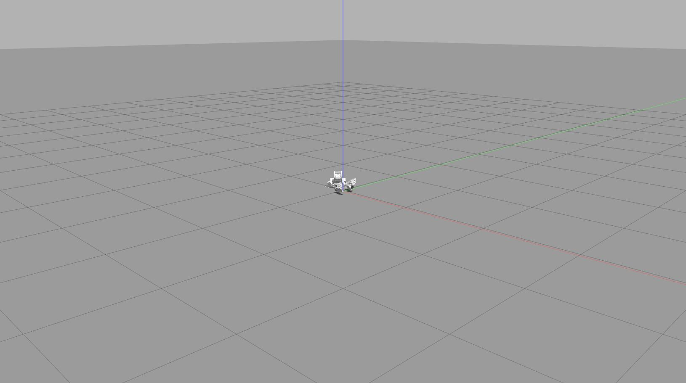
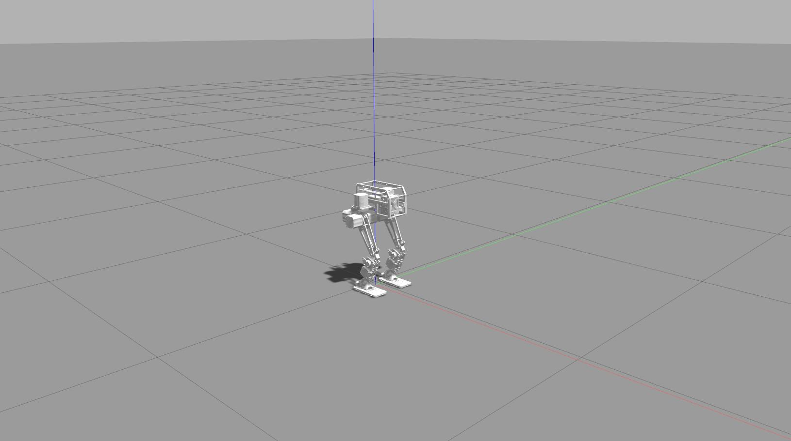
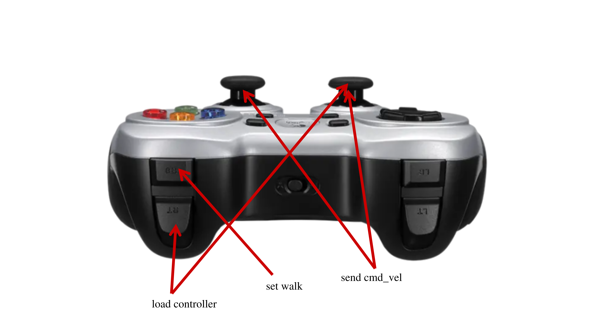

# livelybot_dynamic_control
An open source bipedal robot control framework, based on nonlinear MPC and WBC, adapted to high-end bipedal robots.[Page](https://github.com/HighTorque-Robotics/livelybot_dynamic_control.git)

## Installation

### Install dependencies

- [OCS2](https://leggedrobotics.github.io/ocs2/installation.html#prerequisites)

- [ROS1-Noetic](http://wiki.ros.org/noetic)

### OCS2

OCS2 is a huge monorepo; **DO NOT** try to compile the whole repo. You only need to compile `ocs2_legged_robot_ros` and
its dependencies following the step below.

1. You are supposed to clone the OCS2, pinocchio, and hpp-fcl as described in the documentation of OCS2.
   ```bash
   # Clone OCS2
   git clone https://github.com/leggedrobotics/ocs2.git
   # Clone pinocchio
   git clone --recurse-submodules https://github.com/leggedrobotics/pinocchio.git
   # Clone hpp-fcl
   git clone --recurse-submodules https://github.com/leggedrobotics/hpp-fcl.git
   # Clone ocs2_robotic_assets
   git clone https://github.com/leggedrobotics/ocs2_robotic_assets.git
   # Install dependencies
   sudo apt install liburdfdom-dev liboctomap-dev libassimp-dev
   ```
2. Compile the `ocs2_legged_robot_ros` package with [catkin tools](https://catkin-tools.readthedocs.io/en/latest/)
   instead of `catkin_make`. It will take you about ten minutes.

   ```bash
   catkin config -DCMAKE_BUILD_TYPE=RelWithDebInfo 
   catkin build ocs2_legged_robot_ros ocs2_self_collision_visualization
   ```
   Ensure you can command the ANYmal as shown in
   the [document](https://leggedrobotics.github.io/ocs2/robotic_examples.html#legged-robot) and below.
   
### Clone and Build

```shell

# Clone
mkdir -p <catkin_ws_name>/src
cd <catkin_ws_name>/src
git clone git@github.com:HighTorque-Robotics/livelybot_dynamic_control.git

# Build
cd <catkin_ws_name>
catkin init
catkin config -DCMAKE_BUILD_TYPE=RelWithDebInfo

# for different use build 
#  gazebo simulation 
catkin build legged_controllers legged_hunter_description legged_gazebo
```

## Quick Start
- Gazebo Simulation

[]()

### Simulation

Run the gazebo simulation and load the controller:

```shell
roslaunch legged_controllers one_start_gazebo.launch    
```

### Robot hardware

load the controller

```shell
roslaunch legged_controllers one_start_real.launch
```

***Notes:***
    After the user starts the simulation, the robot falls down in Gazebo.
 Gazebo
     First the user needs to set ***kp_position=100***, ***kd_position=1*** in rqt (need refresh) and reset the simulation by pressing ***Ctrl+Shift+R*** to make the robot stand up.  



## Gamepad Control

1. Start controller
```
Press the left joystick once，than push RT
```


Terminal appears "Successfully load the controller"

2. Switch to walking mode

```
push RB
```

3. Use the joystick to control robot movement

The following is a schematic diagram of the handle operation:



## Simulation Without Gamepad


## Reference

### Code Reference

https://bridgedp.github.io/hunter_bipedal_control

https://github.com/qiayuanl/legged_control

### Paper Reference

#### State Estimation

```
[1] Flayols T, Del Prete A, Wensing P, et al. Experimental evaluation of simple estimators for humanoid robots[C]//2017 IEEE-RAS 17th International Conference on Humanoid Robotics (Humanoids). IEEE, 2017: 889-895.

[2] Bloesch M, Hutter M, Hoepflinger M A, et al. State estimation for legged robots-consistent fusion of leg kinematics and IMU[J]. Robotics, 2013, 17: 17-24.

```

#### MPC
```
[3] Di Carlo J, Wensing P M, Katz B, et al. Dynamic locomotion in the mit cheetah 3 through convex model-predictive control[C]//2018 IEEE/RSJ international conference on intelligent robots and systems (IROS). IEEE, 2018: 1-9.

[4] Grandia R, Jenelten F, Yang S, et al. Perceptive Locomotion Through Nonlinear Model-Predictive Control[J]. IEEE Transactions on Robotics, 2023.

[5] Sleiman J P, Farshidian F, Minniti M V, et al. A unified mpc framework for whole-body dynamic locomotion and manipulation[J]. IEEE Robotics and Automation Letters, 2021, 6(3): 4688-4695.
```

#### WBC
```
[6] Bellicoso C D, Gehring C, Hwangbo J, et al. Perception-less terrain adaptation through whole body control and hierarchical optimization[C]//2016 IEEE-RAS 16th International Conference on Humanoid Robots (Humanoids). IEEE, 2016: 558-564.

[7] Kim D, Di Carlo J, Katz B, et al. Highly dynamic quadruped locomotion via whole-body impulse control and model predictive control[J]. arXiv preprint arXiv:1909.06586, 2019.
```
